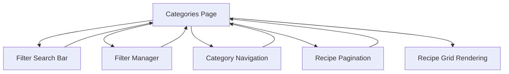
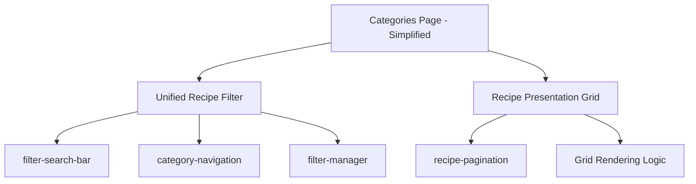

# Categories Page Refactoring - Product Requirements Document (PRD)

## Document Information
- **Project**: My Cook Book Categories Page Refactoring
- **Date**: 2025-06-23
- **Status**: Implementation Ready
- **Version**: 1.0

## Executive Summary

The categories page currently consists of a monolithic 1000+ line component that handles multiple responsibilities from database queries to UI rendering. This refactoring will consolidate related components while preserving existing well-designed components, resulting in better separation of concerns and improved maintainability.

## Current State Analysis

### Categories Page Architecture
```
categories-page.js (1012 lines)
├── Database connection (Firebase queries)
├── Filter state management  
├── Search functionality coordination
├── Category navigation handling
├── Grid layout calculations
├── Recipe card rendering
├── Pagination logic
├── URL parameter synchronization
├── Authentication state handling
└── Complex component event coordination
```

### Existing Components
1. **filter-manager** - Well-designed filter modal with state management
2. **category-navigation** - Clean category tabs/dropdown UI component  
3. **recipe-pagination** - Pure UI pagination controls
4. **filter-search-bar** - Simple search input component

### Current Component Communication


## Problem Statement

### Technical Issues
1. **Excessive Complexity**: Single component handling 8+ distinct responsibilities
2. **Scattered Logic**: Presentation logic mixed with business logic
3. **Tight Coupling**: Heavy coordination between 6 separate components
4. **Testing Challenges**: Difficult to test individual concerns in isolation
5. **Maintenance Burden**: Changes require modifications across multiple areas

### Code Metrics
- **Categories Page**: 1012 lines (target: ~300 lines)
- **Component Events**: 12+ different event handlers
- **State Variables**: 15+ component state variables
- **Method Count**: 40+ methods handling diverse responsibilities

## Proposed Solution

### Architecture Overview
Consolidate related components into two main presentation components while preserving existing well-tested sub-components.



### Component Responsibilities

#### 1. Unified Recipe Filter (`unified-recipe-filter`)
**Purpose**: Single component managing all filtering functionality

**Contains (as internal components)**:
- `filter-search-bar` - Search input
- `category-navigation` - Category tabs/dropdown
- `filter-manager` - Advanced filter modal

**Responsibilities**:
- Unified filter state management
- Coordinated filter UI updates
- Single `filters-changed` event emission
- Internal component communication

**API**:
```javascript
// Events
'filters-changed': { 
  searchQuery: string,
  category: string, 
  activeFilters: object,
  hasActiveFilters: boolean 
}

// Methods  
setFilters(filters)
resetFilters()
setCurrentCategory(category)
setSearchQuery(query)
```

#### 2. Recipe Presentation Grid (`recipe-presentation-grid`)
**Purpose**: Handle all recipe display and navigation

**Contains (as internal component)**:
- `recipe-pagination` - Page controls

**Responsibilities**:
- Recipe grid rendering and layout
- Responsive grid calculations
- Loading states and error handling
- Pagination state management
- Recipe card creation and event handling

**API**:
```javascript
// Props
recipes: Array
currentPage: number
recipesPerPage: number
loading: boolean

// Events
'page-changed': { page: number, direction: string }
'recipe-opened': { recipeId: string }

// Methods
setRecipes(recipes)
setCurrentPage(page)
setLoading(loading)
calculateOptimalLayout()
```

#### 3. Simplified Categories Page
**Purpose**: Core business logic and component coordination

**Responsibilities** (reduced to 4 main areas):
1. **Database Operations**: Firebase queries and data fetching
2. **Authentication**: User state and favorites management  
3. **Component Communication**: Bridge between filter and presentation
4. **URL Synchronization**: Route parameters and navigation

**Removed Responsibilities**:
- Filter state management → moved to unified-recipe-filter
- Grid rendering logic → moved to recipe-presentation-grid
- Pagination logic → moved to recipe-presentation-grid
- Component event coordination → simplified to 2 components

## Implementation Plan

### Phase 1: PRD Documentation ✓
- [x] Document current state and problems
- [x] Define new architecture and component responsibilities
- [x] Create implementation roadmap

### Phase 2: Create Unified Recipe Filter
**Tasks**:
1. Create `src/lib/collections/unified-recipe-filter/` directory structure
2. Implement component with separated architecture pattern:
   - `unified-recipe-filter.js` - Main component logic
   - `unified-recipe-filter.html` - Template structure  
   - `unified-recipe-filter-styles.js` - Component styles
   - `unified-recipe-filter-config.js` - Configuration constants
3. Integrate existing components as internal components
4. Implement unified filter state management
5. Create clean event API for categories page

### Phase 3: Create Recipe Presentation Grid  
**Tasks**:
1. Create `src/lib/collections/recipe-presentation-grid/` directory structure
2. Extract grid rendering logic from categories page
3. Integrate `recipe-pagination` as internal component
4. Implement responsive layout calculations
5. Add loading states and error handling
6. Create recipe card management

### Phase 4: Simplify Categories Page
**Tasks**:
1. Remove extracted filter and presentation logic (~600+ lines)
2. Implement simplified component communication (2 components vs 6)
3. Maintain existing URL synchronization functionality
4. Preserve authentication state handling
5. Update component imports and references

### Phase 5: Testing and Integration
**Tasks**:
1. Test component integration and functionality
2. Verify responsive behavior and loading states
3. Clean up unused imports and methods
4. Update documentation and comments
5. Run linting and type checking

## Success Metrics

### Code Quality Improvements
- **Categories Page Reduction**: From 1012 lines to ~300 lines (70% reduction)
- **Component Count**: From 6 coordinated components to 2 main components
- **Event Handlers**: From 12+ handlers to 2 main event listeners
- **Method Complexity**: Reduce method count by 60%

### Maintainability Improvements  
- **Separation of Concerns**: Clear component boundaries
- **Testability**: Components testable in isolation
- **Reusability**: Filter component reusable across pages
- **Code Readability**: Focused component responsibilities

### Performance Considerations
- **Component Coordination**: Reduced overhead from 6→2 components
- **Event System**: Simplified event flow
- **Rendering Logic**: Consolidated in single presentation component
- **Memory Usage**: Reduced duplicate state management

## Risk Assessment

### Low Risk
- **Existing Component Preservation**: Reusing proven filter-manager, pagination, etc.
- **Functionality Preservation**: No user-facing changes expected
- **Architecture Pattern**: Following established separated component pattern

### Medium Risk  
- **Component Integration**: Ensuring smooth internal component communication
- **State Management**: Properly migrating complex filter state logic
- **Responsive Behavior**: Maintaining existing layout calculations

### Mitigation Strategies
- **Incremental Implementation**: Phase-by-phase approach with testing
- **Component Isolation**: Test each new component independently  
- **Rollback Plan**: Preserve original components until testing complete
- **User Testing**: Verify no functionality regression

## Future Considerations

### Extensibility
- **New Filter Types**: Easy to add through unified filter component
- **Alternative Layouts**: Grid component designed for layout variations  
- **Performance Optimization**: Clear separation enables targeted optimizations

### Code Maintenance
- **Component Updates**: Changes isolated to relevant components
- **Feature Addition**: Clear component boundaries for new features
- **Bug Fixes**: Easier to locate and fix issues in focused components

## Conclusion

This refactoring will significantly improve the categories page architecture by:
1. **Reducing complexity** through component consolidation
2. **Preserving functionality** by reusing existing components
3. **Improving maintainability** through clear separation of concerns
4. **Enabling future enhancements** through better component design

The phased implementation approach ensures minimal risk while delivering substantial improvements to code quality and developer experience.